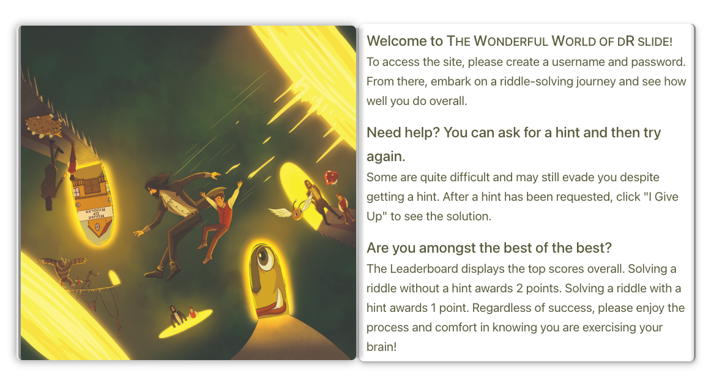
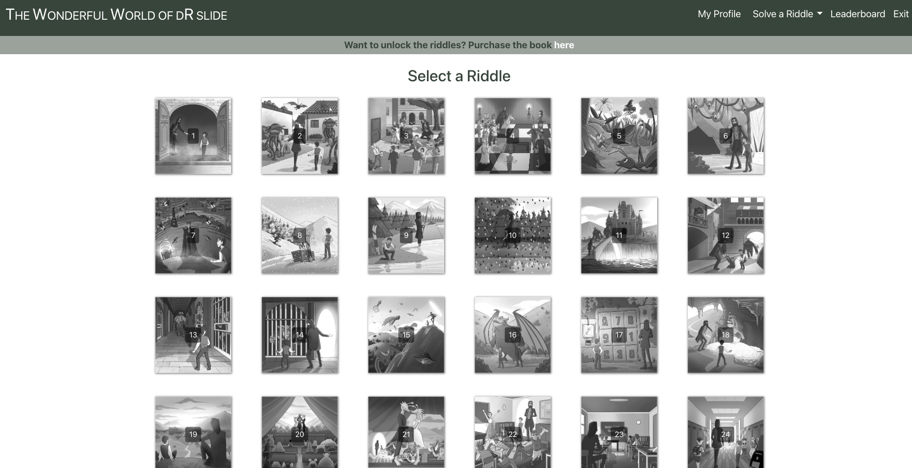
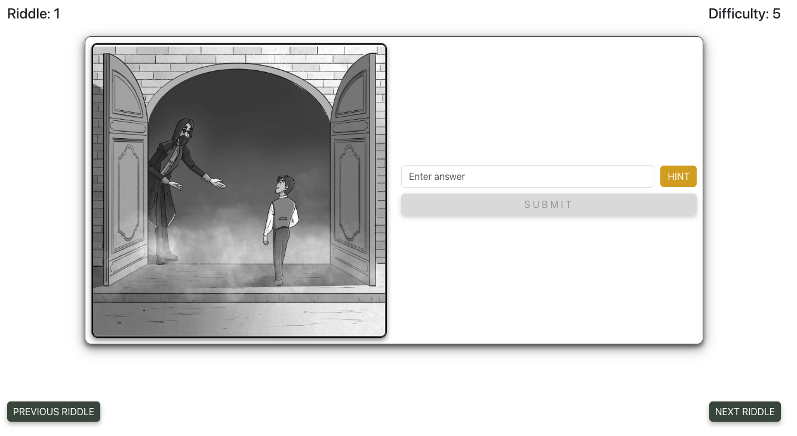
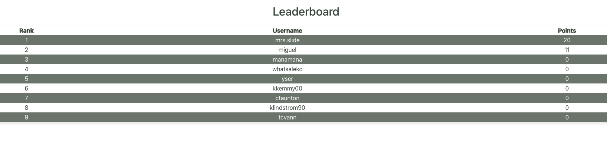

# The Wonderful World of dR slide

## Description

"The Wonderful World of dR Slide" is an interactive web application that offers a unique and engaging experience for riddle enthusiasts. Developed using the MERN stack, this project was driven by a passion for creating an immersive and competitive environment for riddle solving. Our goal was to build a platform that not only supports the release of a related book but also adds an interactive layer to the reading experience.

Key motivations and learnings:

- **Responsive Design**: Ensuring seamless user experience across desktops, tablets, and smartphones.
- **Full Stack Development**: Utilizing the MERN stack for robust and scalable application performance.
- **User Engagement**: Integrating a MongoDB database for dynamic user interaction and competitive features.
- **Collaboration**: Working closely with the author and publisher to refine UI/UX, enhancing the product's appeal.

## Table of Contents

If your README is long, add a table of contents to make it easy for users to find what they need.

- [Usage](#usage)
- [Credits](#credits)
- [License](#license)
- [Badges](#badges)
- [Features](#features)
- [How to Contribute](#how-to-contribute)

## Usage

"The Wonderful World of dR Slide" is easy to use:

1. Purchase [The Wonderful World of dR slide: A Book of Riddles for All by Michael Schecter, MD](https://www.warrenpublishing.net/store/p502/PRE-ORDER_The_Wonderful_World_of_dR_slide%3A_A_Book_of_Riddles_for_All_%28hard_cover%29_by_Michael_Schecter%2C_MD.html)
2. Visit [The Wonderful World of dR slide](https://www.thewonderfulworldofdrslide.com/).
3. Explore the riddles and try solving them.
4. Use hints if you get stuck.
5. Post your answers and see how you rank on the leaderboard.

Here's a sneak peek of what you can expect:

## Credits

This project was developed by Emmanuel Lakis (https://github.com/pexApred) in collaboration with the book's author and publisher. Special thanks to:

- [Michael Schecter, MD](https://www.warrenpublishing.net/store/p502/PRE-ORDER_The_Wonderful_World_of_dR_slide%3A_A_Book_of_Riddles_for_All_%28hard_cover%29_by_Michael_Schecter%2C_MD.html)
- [Warren Publishing](https://www.warrenpublishing.net/)

## License

This project is licensed under the Apache License 2.0 - see the [LICENSE](LICENSE) file for details. Please note that while this license typically allows for broad use, modification, and distribution of the code, this specific project is not seeking contributions or external utilization in other projects.

## Badges

## Features

- **Interactive Riddle Solver**: Engage with challenging riddles and post your answers.
- **Real-Time Leaderboard**: Compete with others and track your ranking.
- **Responsive Design**: Enjoy a consistent experience across all devices.
- **Purchase Links**: Easy access to buy the book directly from the site.

## How to Contribute

This repository is not open for contributions. It is a personal project and is meant to serve a specific purpose as it is. We appreciate your interest but kindly request that you do not make pull requests or submit issues.